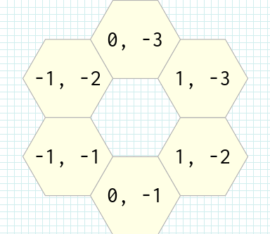
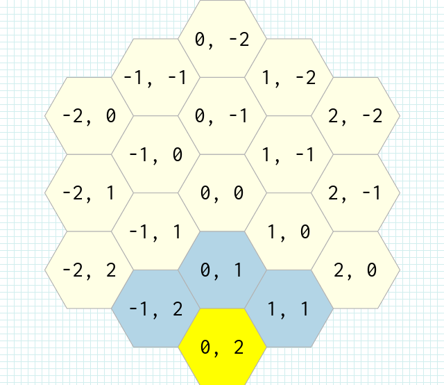
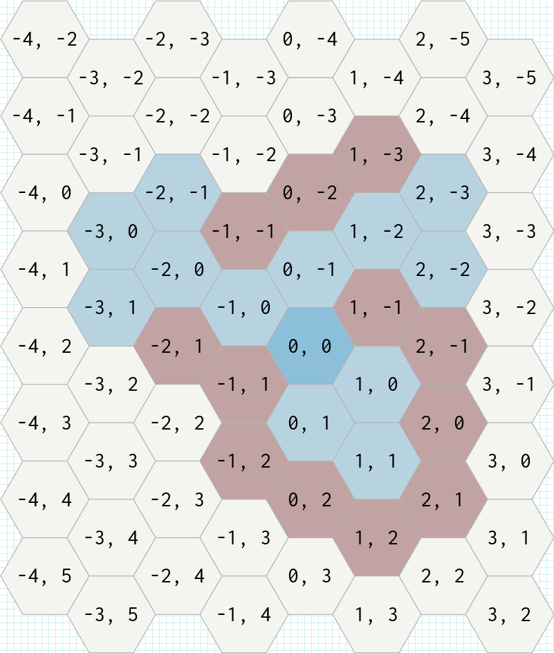
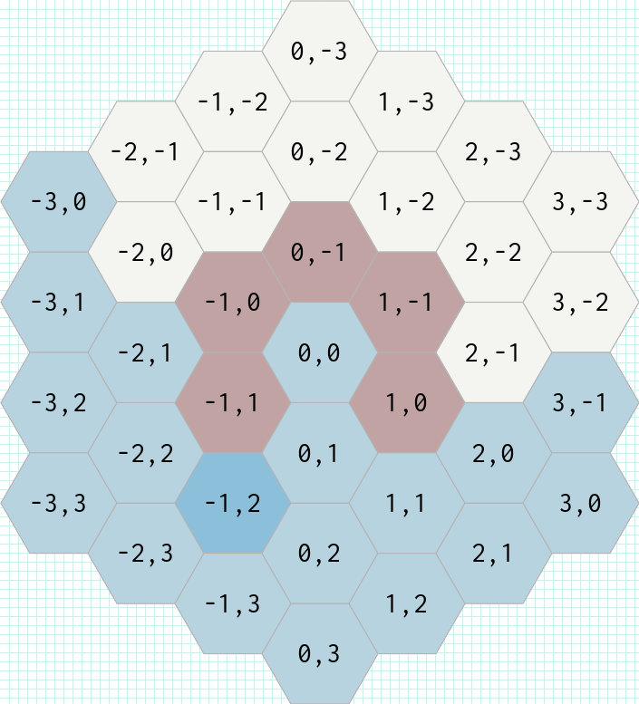
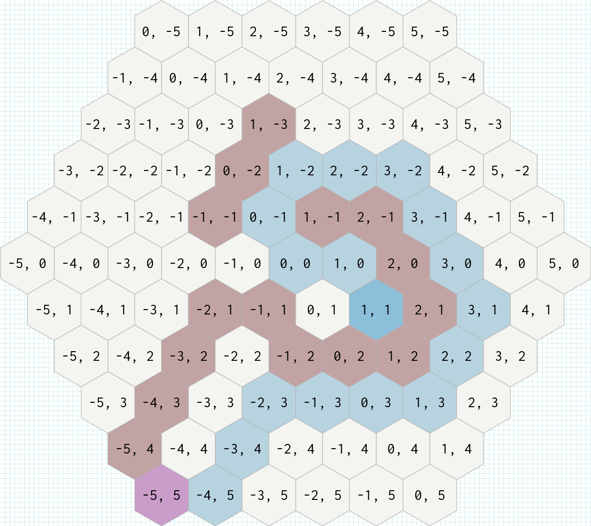
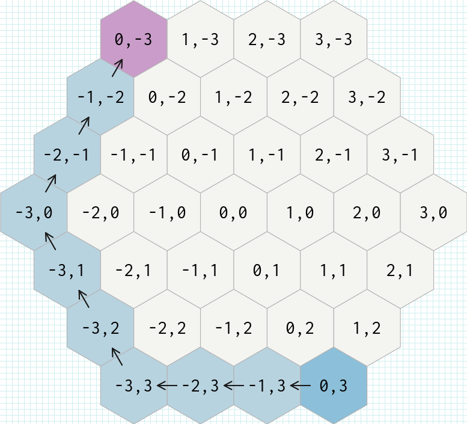
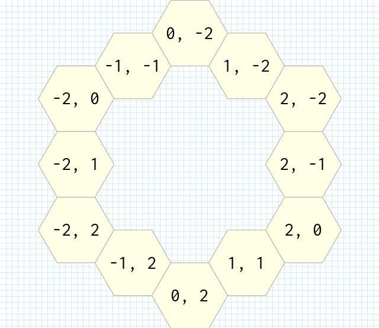
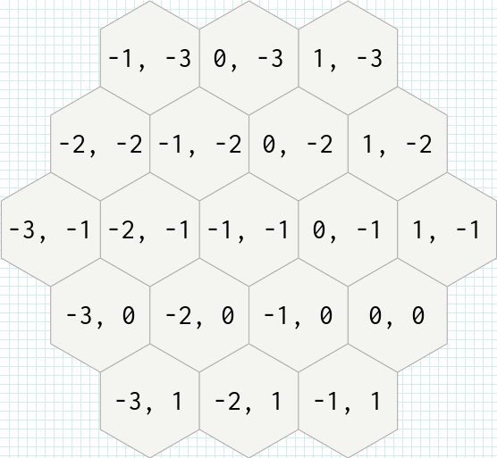
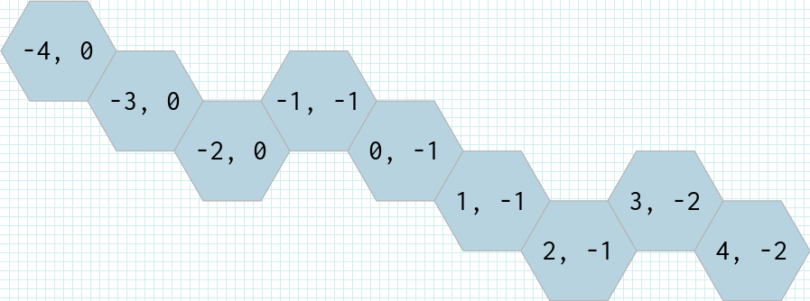

# Rhex
[](https://github.com/mersen1/rhex/actions/workflows/ci.yml)

Ruby toolkit for hexagonal grids based on cube/axial coordinates. It provides geometry utilities (neighbors, distance, reachability, rings, line drawing, path-finding) and rendering helpers that generate PNGs with RMagick. The implementation follows the concepts from https://www.redblobgames.com/grids/hexagons/.

## Requirements
- Ruby 3.3.7 or newer (tested against 3.3.7)
- ImageMagick installed on your system (needed for `rmagick`)
- Bundler for development/test tasks

## Installation
Use the Git source with Bundler:
```ruby
# Gemfile
gem "rhex", git: "https://github.com/mersen1/rhex.git"
```
Then install and require:
```shell
bundle install
```
```ruby
require "rhex"
```

## Quick start
```ruby
require "rhex"

origin = Rhex::AxialHex.new(0, 0)
grid   = origin.spiral_ring(2).to_grid # includes origin and rings up to radius 2

neighbors = grid.neighbors(origin)     # 6 surrounding hexes inside the grid
distance  = origin.distance(Rhex::AxialHex.new(0, -2)) # => 2

# Render to images/sample_grid.png (centered automatically)
grid.to_pic("sample_grid", hex_size: 48, orientation: Rhex::GridToPic::POINTY_TOPPED)
```

## Core types
- `Rhex::CubeHex` – stores `q`, `r`, `s` coordinates plus optional `data` payload and optional `image_config` used for rendering.
- `Rhex::AxialHex` – lightweight wrapper around `CubeHex` that omits `s`; convert with `to_cube` / `to_axial`.
- Equality, `eql?`, and `hash` are coordinate based, so hexes with the same coordinates compare equal and work as hash keys.
- Reflection helpers: `reflection_q`, `reflection_r`, `reflection_s` reflect across the corresponding axes relative to an optional reference point.

## Grid methods
Grid methods operate on collections of hexes and respect grid boundaries and obstacles.

### neighbors(hex) -> Array<CubeHex>
Returns neighbors of `hex` that exist inside the grid.


```ruby
origin = Rhex::AxialHex.new(0, 0)
grid   = origin.spiral_ring(1).to_grid
grid.neighbors(origin) # => 6 surrounding hexes already in the grid
```

### neighbor(hex, direction_index) -> CubeHex?
Returns a single neighbor by index `0..5`. Raises `DirectionIndexOutOfRange` for an invalid index; returns `nil` when the neighbor is outside the grid.


```ruby
origin = Rhex::AxialHex.new(0, 0)
grid   = origin.spiral_ring(1).to_grid
grid.neighbor(origin, 0)                # => neighbor hex
Rhex::Grid[origin].neighbor(origin, 0)  # => nil (missing from grid)
```

### reachable(source, movements_limit = 1, obstacles: []) -> Array<CubeHex>
All cells inside the grid that are reachable within the given number of steps, always including the source. Any hexes listed in `obstacles` are excluded.


```ruby
grid     = Rhex::AxialHex.new(0, 0).spiral_ring(2).to_grid
start    = grid[ Rhex::AxialHex.new(0, 0) ]
obstacle = Rhex::AxialHex.new(1, 0)
grid.reachable(start, 2, obstacles: [obstacle])
```

### field_of_view(source, obstacles = []) -> Array<CubeHex>
All grid cells visible from `source` without intersecting obstacles. With empty `obstacles`, returns every cell except the source.


```ruby
grid = Rhex::AxialHex.new(0, 0).spiral_ring(3).to_grid
source = grid[Rhex::AxialHex.new(0, 0)]
obstacles = [Rhex::AxialHex.new(1, 0)]
grid.field_of_view(source, obstacles)
```

### bfs_path(source, target, obstacles: []) -> Array<AxialHex>
Shortest path inside the grid using breadth-first traversal. Raises if the source or target is missing from the grid. Returns an empty array when unreachable. When `ImageConfigs.path_image_config` is loaded, path cells carry that image config.


```ruby
grid = Rhex::AxialHex.new(0, 0).spiral_ring(3).to_grid
src  = grid[Rhex::AxialHex.new(0, 0)]
dst  = Rhex::AxialHex.new(2, -1)
grid.bfs_path(src, dst, obstacles: [Rhex::AxialHex.new(1, 0)])
```

### dfs_path(source, target, obstacles: []) -> Array<AxialHex>
Depth-first traversal that returns the first path it discovers to the target (not guaranteed to be the shortest). Obstacle handling and validation mirror `bfs_path`; unreachable paths return an empty array.


```ruby
grid = Rhex::AxialHex.new(0, 0).spiral_ring(3).to_grid
src  = grid[Rhex::AxialHex.new(0, 0)]
dst  = Rhex::AxialHex.new(2, -1)
grid.dfs_path(src, dst, obstacles: [Rhex::AxialHex.new(1, 0)])
```

## Hex methods
Hex methods operate on individual coordinates and small derived collections.

### distance(other) -> Integer
Manhattan distance between two hexes in cube coordinates.

```ruby
a = Rhex::AxialHex.new(0, 0)
b = Rhex::AxialHex.new(2, -1)
a.distance(b) # => 2
```

### ring(radius = 1) -> Array<CubeHex>
All cells exactly `radius` steps away from the current hex.


```ruby
center = Rhex::AxialHex.new(0, 0)
center.ring(2) # => hexes at distance 2
```

### spiral_ring(radius = 1) -> Array<CubeHex>
Concentric rings for radii `1..radius` plus the origin. Raises `RadiusCannotBeZero` when `radius` is `0`.


```ruby
center = Rhex::AxialHex.new(0, 0)
center.spiral_ring(2) # => origin + rings 1 and 2
```

### linedraw(target) -> Array<CubeHex>
Straight line of hexes between two points, rounded to the nearest centers; includes both endpoints.


```ruby
start = Rhex::AxialHex.new(0, 0)
finish = Rhex::AxialHex.new(3, -2)
start.linedraw(finish)
```

### reflection_q/r/s(reference_point = CubeHex.new(0,0,0)) -> CubeHex
Mirror the hex across the `q`, `r`, or `s` axis relative to an optional reference point.

```ruby
hex = Rhex::AxialHex.new(1, -2).to_cube
hex.reflection_q            # mirror over q axis through origin
hex.reflection_r(reference_point: Rhex::CubeHex.new(1, 0, -1))
```

### add(hex) / subtract(hex) -> CubeHex
Coordinate-wise addition or subtraction, reused by several other operations.

```ruby
a = Rhex::AxialHex.new(0, 0).to_cube
b = Rhex::AxialHex.new(1, -1).to_cube
a.add(b)      # => CubeHex(1, -1, 0)
a.subtract(b) # => CubeHex(-1, 1, 0)
```

### to_axial -> AxialHex / AxialHex#to_cube -> CubeHex
Safe conversions between cube and axial representations.

```ruby
cube  = Rhex::CubeHex.new(0, 1, -1)
axial = cube.to_axial
axial.to_cube # => original cube
```

### image_config (attr_accessor) / data (attr_reader)
Arbitrary payload and rendering options preserved and propagated into derived hexes.

```ruby
config = Rhex::Draw::Hexagon::DEFAULT_IMAGE_CONFIG
hex = Rhex::AxialHex.new(0, 0, data: { terrain: :grass }, image_config: config)
hex.image_config # => returns image properties
hex.data         # => { terrain: :grass }
```

### ==, eql?, hash
Coordinate-based equality and hashing, suitable for hash keys and set semantics.

```ruby
a = Rhex::AxialHex.new(0, 0)
b = Rhex::AxialHex.new(0, 0)
a == b    # true
{ a => "same" }[b] # "same"
```

### Rhex::CubeHex::Math::Hexagon#movement_range(radius) -> Integer
Number of cells reachable within `radius` steps (including the origin).


```ruby
include Rhex::CubeHex::Math::Hexagon
movement_range(2) # => 19
```

Example (path-finding with obstacles):
```ruby
grid      = Rhex::AxialHex.new(0, 0).spiral_ring(3).to_grid
source    = grid[Rhex::AxialHex.new(0, 0)]
target    = Rhex::AxialHex.new(2, -1)
obstacles = [Rhex::AxialHex.new(1, 0)]

path = grid.bfs_path(source, target, obstacles: obstacles)
```

## Working with grids
- `Rhex::Grid[]` builds a grid from hexes; duplicates are overwritten by coordinate (`q`, `r`).
- `#add`, `#merge`, `#include?`, `#exclude?`, `#size` behave like a set keyed on coordinates.
- `Enumerable#to_grid` converts any collection of hexes into a `Grid` (or a custom grid class via arguments).
- `#to_grid(klass, ...)` converts one grid into another grid implementation while reusing its contents.

## Oriented grids (for rendering)
- `Rhex::FlatToppedGrid` and `Rhex::PointyToppedGrid` decorate stored hexes to compute screen coordinates based on a `hex_size`.
- Each oriented grid exposes `#hex_size` and `#pointy_topped?`, and every added hex is wrapped in the appropriate decorator (`Rhex::Decorators::FlatToppedHex` or `Rhex::Decorators::PointyToppedHex`).

## Rendering to PNG
- Any grid can be rendered with `grid.to_pic("filename", hex_size: 64, orientation: Rhex::GridToPic::DEFAULT_ORIENTATION)`.
- The renderer:
  - Builds an oriented grid (`:flat_topped` by default) and centers it automatically using `CanvasMarkups::AutoCanvasMarkup`.
  - Draws each hex through `Rhex::Draw::Hexagon`, labeling it with its `q, r` coordinates.
  - Saves the image to `images/filename.png` inside the gem/project root.
- Default colors come from `Rhex::Draw::Hexagon::DEFAULT_IMAGE_CONFIG`. You can override per hex:
```ruby
config = Rhex::Draw::Hexagon::ImageConfig.new(
  hexagon: Rhex::Draw::Hexagon::ImageProperties.new(color: "#FFFACD", stroke_color: "#222222"),
  text:    Rhex::Draw::Hexagon::ImageProperties.new(color: "#333333", stroke_color: "none", font_size: 24)
)
hex = Rhex::AxialHex.new(0, 0, image_config: config)
[hex].to_grid.to_pic("custom_hex")
```

### Font selection
Rhex ships with a bundled Inconsolata font (`fonts/Inconsolata-Regular.ttf`) and always uses it when rendering text. Custom fonts are intentionally not supported; attempting to set a custom font path raises an error.

## Image configuration files
`Rhex::ImageConfigs.load!(path)` reads every `*_config.yml` in the given directory and defines readers named after each file (e.g., `path_image_config`). Each YAML entry is exposed as an `OpenStruct`, so keys like `hexagon.color`, `hexagon.stroke_color`, and `text.font_size` can be read by the renderer.

Example YAML (`path_image_config.yml`):
```yaml
hexagon:
  color: "#B3D5E6"
  stroke_color: "#B3B3B3"
text:
  color: "#000000"
  stroke_color: "none"
  font_size: 32
```
Usage:
```ruby
Rhex::ImageConfigs.load!(Rhex.root.join("config", "images"))
source = Rhex::AxialHex.new(0, 0, image_config: Rhex::ImageConfigs.source_image_config)
grid   = [source].to_grid
grid.to_pic("with_configs")
```

## Benchmarks

Performance comparisons between native C extensions and optimized Ruby implementations. The native extensions provide significant speedups, especially for computationally intensive operations like field of view calculations.

### Running Benchmarks

First, ensure the native extension is compiled:
```shell
bundle exec rake compile
```

Then run the benchmarks:

**Grid operations (reachable, field_of_view):**
```shell
ruby benchmarks/grid_native_vs_ruby.rb
```

**Pathfinding (BFS, DFS):**
```shell
ruby benchmarks/bfs_dfs_native_vs_ruby.rb
```

You can customize benchmark parameters via environment variables:
- `RHEX_BENCH_RANGE` - Grid radius (default: 20 for grid ops, 30 for pathfinding)
- `RHEX_BENCH_MOVES` - Movement limit for reachable (default: 3)
- `RHEX_BENCH_OBSTACLE_RATIO` - Ratio of obstacles (default: 0.1 for grid ops, 0.2 for pathfinding)
- `RHEX_BENCH_SEED` - Random seed for reproducibility

### Example Results

**Grid Operations:**
```shell
Building grid (Range: 20)...
Seed: 279828578778449001641381329076603781011
Grid size: 1261, moves: 3, obstacles: 126
Source: -5,-3

--- Reachable (BFS with Limit) ---
    native reachable:      157.8 i/s
      ruby reachable:       20.8 i/s - 7.57x  slower

--- Field of View (Raycasting) ---
          native fov:       21.7 i/s
            ruby fov:        0.1 i/s - 157.50x  slower
```

**Pathfinding:**
```shell
Building grid (Range: 30)...
Seed: 279828578778449001641381329076603781011
Grid size: 2791, obstacles: 558
Source: -10,5 -> Target: 8,-7
Warming up Native Cache...

--- Breadth-First Search (Shortest Path) ---
          native bfs:       40.6 i/s
            ruby bfs:       10.7 i/s - 3.78x  slower

--- Depth-First Search (Any Path) ---
          native dfs:       39.0 i/s
            ruby dfs:       12.7 i/s - 3.06x  slower
```

## Testing
The project uses RSpec with 100% coverage enforced by SimpleCov. Run the suite with:
```shell
bundle exec rspec
```

## Continuous integration
- GitHub Actions runs `bundle exec rspec` on every push and pull request to `master`.
- The badge at the top of this README links to the latest run results.
