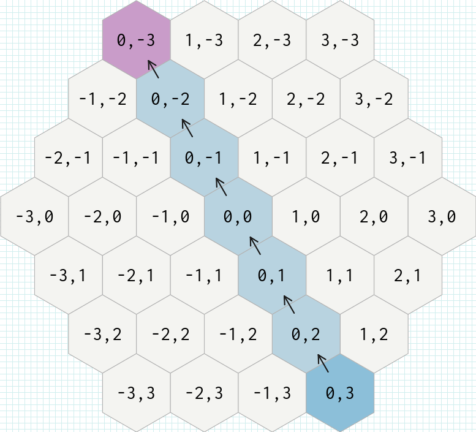

# Rhex
[](https://github.com/mersen1/rhex/actions/workflows/ci.yml)

Ruby toolkit for hexagonal grids based on cube/axial coordinates. It provides geometry utilities (neighbors, distance, reachability, rings, line drawing, path-finding) and rendering helpers that generate PNGs with RMagick. The implementation follows the concepts from https://www.redblobgames.com/grids/hexagons/.

## Requirements
- Ruby 3.3.7 or newer (tested against 3.3.7)
- ImageMagick installed on your system (needed for `rmagick`)
- Bundler for development/test tasks

## Installation
Use the Git source with Bundler:
```ruby
# Gemfile
gem "rhex", git: "https://github.com/mersen1/rhex.git"
```
Then install and require:
```shell
bundle install
```
```ruby
require "rhex"
```

## Quick start
```ruby
require "rhex"

origin = Rhex::AxialHex.new(0, 0)
grid   = origin.spiral_ring(2).to_grid # includes origin and rings up to radius 2

neighbors = grid.neighbors(origin)     # 6 surrounding hexes inside the grid
distance  = origin.distance(Rhex::AxialHex.new(0, -2)) # => 2

# Render to images/sample_grid.png (centered automatically)
grid.to_pic("sample_grid", hex_size: 48, orientation: Rhex::GridToPic::POINTY_TOPPED)
```

## Core types
- `Rhex::CubeHex` – stores `q`, `r`, `s` coordinates plus optional `data` payload and optional `image_config` used for rendering.
- `Rhex::AxialHex` – lightweight wrapper around `CubeHex` that omits `s`; convert with `to_cube` / `to_axial`.
- Equality, `eql?`, and `hash` are coordinate based, so hexes with the same coordinates compare equal and work as hash keys.
- Reflection helpers: `reflection_q`, `reflection_r`, `reflection_s` reflect across the corresponding axes relative to an optional reference point.

## Grid methods
Grid methods operate on collections of hexes and respect grid boundaries and obstacles.

### neighbors(hex) -> Array<CubeHex>
Returns neighbors of `hex` that exist inside the grid.


```ruby
origin = Rhex::AxialHex.new(0, 0)
grid   = origin.spiral_ring(1).to_grid
grid.neighbors(origin) # => 6 surrounding hexes already in the grid
```

### neighbor(hex, direction_index) -> CubeHex?
Returns a single neighbor by index `0..5`. Raises `DirectionIndexOutOfRange` for an invalid index; returns `nil` when the neighbor is outside the grid.


```ruby
origin = Rhex::AxialHex.new(0, 0)
grid   = origin.spiral_ring(1).to_grid
grid.neighbor(origin, 0)                # => neighbor hex
Rhex::Grid[origin].neighbor(origin, 0)  # => nil (missing from grid)
```

### reachable(source, movements_limit = 1, obstacles: []) -> Array<CubeHex>
All cells inside the grid that are reachable within the given number of steps, always including the source. Any hexes listed in `obstacles` are excluded. `grid_algorithms` is injected into the grid via `Grid.new(hexes, grid_algorithms:)` (defaults to `Rhex::GridAlgorithms::INSTANCE`).


```ruby
grid     = Rhex::AxialHex.new(0, 0).spiral_ring(2).to_grid
start    = grid[ Rhex::AxialHex.new(0, 0) ]
obstacle = Rhex::AxialHex.new(1, 0)
grid.reachable(start, 2, obstacles: [obstacle])
```

### field_of_view(source, obstacles: []) -> Array<CubeHex>
All grid cells visible from `source` without intersecting obstacles. With empty `obstacles`, returns every cell except the source.


```ruby
grid = Rhex::AxialHex.new(0, 0).spiral_ring(3).to_grid
source = grid[Rhex::AxialHex.new(0, 0)]
obstacles = [Rhex::AxialHex.new(1, 0)]
grid.field_of_view(source, obstacles: obstacles)
```

### bfs_path(source, target, obstacles: []) -> Array<CubeHex>
Shortest path inside the grid using breadth-first traversal. Raises `Grid::GridDoesNotContainSourceError` / `GridDoesNotContainTargetError` if the source or target is missing from the grid, and `Grid::PathNotFoundError` when the target is unreachable.


```ruby
grid = Rhex::AxialHex.new(0, 0).spiral_ring(3).to_grid
src  = grid[Rhex::AxialHex.new(0, 0)]
dst  = Rhex::AxialHex.new(2, -1)
grid.bfs_path(src, dst, obstacles: [Rhex::AxialHex.new(1, 0)])
```

### dfs_path(source, target, obstacles: []) -> Array<CubeHex>
Depth-first traversal that returns the first path it discovers to the target (not guaranteed to be the shortest). Obstacle handling and validation mirror `bfs_path`, including the `Grid::PathNotFoundError` raised when the target is unreachable.


```ruby
grid = Rhex::AxialHex.new(0, 0).spiral_ring(3).to_grid
src  = grid[Rhex::AxialHex.new(0, 0)]
dst  = Rhex::AxialHex.new(2, -1)
grid.dfs_path(src, dst, obstacles: [Rhex::AxialHex.new(1, 0)])
```

### astar_path(source, target, obstacles: []) -> Array<CubeHex>
Shortest path using A\* search with a hex-distance heuristic and a binary min-heap. Returns the same length as `bfs_path` but explores fewer cells on large grids. Validation, obstacle handling, and the `Grid::PathNotFoundError` / `GridDoesNotContain*Error` semantics match `bfs_path`.


```ruby
grid = Rhex::AxialHex.new(0, 0).spiral_ring(3).to_grid
src  = grid[Rhex::AxialHex.new(0, 0)]
dst  = Rhex::AxialHex.new(2, -1)
grid.astar_path(src, dst, obstacles: [Rhex::AxialHex.new(1, 0)])
```

## Hex methods
Hex methods operate on individual coordinates and small derived collections.

### distance(other) -> Integer
Distance between two hexes in cube coordinates (the number of steps between them).

```ruby
a = Rhex::AxialHex.new(0, 0)
b = Rhex::AxialHex.new(2, -1)
a.distance(b) # => 2
```

### ring(radius = 1) -> Array<CubeHex>
All cells exactly `radius` steps away from the current hex.


```ruby
center = Rhex::AxialHex.new(0, 0)
center.ring(2) # => hexes at distance 2
```

### spiral_ring(radius = 1) -> Array<CubeHex>
Concentric rings for radii `1..radius` plus the origin. Raises `RadiusCannotBeZero` when `radius` is not positive.


```ruby
center = Rhex::AxialHex.new(0, 0)
center.spiral_ring(2) # => origin + rings 1 and 2
```

### linedraw(target) -> Array<CubeHex>
Straight line of hexes between two points, rounded to the nearest centers; includes both endpoints.


```ruby
start = Rhex::AxialHex.new(0, 0)
finish = Rhex::AxialHex.new(3, -2)
start.linedraw(finish)
```

### reflection_q/r/s(reference_point = CubeHex.new(0,0,0)) -> CubeHex
Mirror the hex across the `q`, `r`, or `s` axis relative to an optional reference point.

```ruby
hex = Rhex::AxialHex.new(1, -2).to_cube
hex.reflection_q                          # mirror over q axis through origin
hex.reflection_r(Rhex::CubeHex.new(1, 0, -1)) # mirror over r axis through a reference point
```

### +(hex) / -(hex) / *(scalar) -> CubeHex
Coordinate-wise addition, subtraction, and scaling, reused by several other operations.

```ruby
a = Rhex::AxialHex.new(0, 0).to_cube
b = Rhex::AxialHex.new(1, -1).to_cube
a + b   # => CubeHex(1, -1, 0)
a - b   # => CubeHex(-1, 1, 0)
b * 2   # => CubeHex(2, -2, 0)
```

### to_axial -> AxialHex / AxialHex#to_cube -> CubeHex
Safe conversions between cube and axial representations.

```ruby
cube  = Rhex::CubeHex.new(0, 1, -1)
axial = cube.to_axial
axial.to_cube # => original cube
```

### image_config (attr_accessor) / data (attr_reader)
Arbitrary payload and rendering options preserved and propagated into derived hexes.

```ruby
config = {
  hexagon: { color: "#F4F4F1", stroke_color: "#B3B3B3" },
  text:    { color: "#000000", stroke_color: "none", font_size: 32 }
}
hex = Rhex::AxialHex.new(0, 0, data: { terrain: :grass }, image_config: config)
hex.image_config # => the validated config hash
hex.data         # => { terrain: :grass }
```

### ==, eql?, hash
Coordinate-based equality and hashing, suitable for hash keys and set semantics.

```ruby
a = Rhex::AxialHex.new(0, 0)
b = Rhex::AxialHex.new(0, 0)
a == b    # true
{ a => "same" }[b] # "same"
```

## Working with grids
- `Rhex::Grid[]` builds a grid from hexes; duplicates are overwritten by coordinate (`q`, `r`).
- `#add`, `#merge`, `#include?`, `#exclude?`, `#size` behave like a set keyed on coordinates.
- `Enumerable#to_grid` converts any collection of hexes into a `Grid` (or a custom grid class via arguments).
- `#to_grid(klass, ...)` converts one grid into another grid implementation while reusing its contents.

## Oriented grids (for rendering)
- `Rhex::FlatToppedGrid` and `Rhex::PointyToppedGrid` decorate stored hexes to compute screen coordinates based on a `hex_size`.
- Each oriented grid exposes `#hex_size` and `#pointy_topped?`, and every added hex is wrapped in the appropriate decorator (`Rhex::Decorators::FlatToppedHex` or `Rhex::Decorators::PointyToppedHex`).

## Rendering to PNG
- Any grid can be rendered with `grid.to_pic("filename", hex_size: 64, orientation: Rhex::GridToPic::DEFAULT_ORIENTATION)`.
- The renderer:
  - Builds an oriented grid (`:flat_topped` by default) and centers it automatically using `CanvasMarkups::AutoCanvasMarkup`.
  - Draws each hex through `Rhex::Draw::Hexagon`, labeling it with its `q, r` coordinates.
  - Saves the image to `images/filename.png` inside the gem/project root.
- Pass an ordered list of hexes via `path:` to draw a direction arrow on each hex pointing towards the next one in the path (drawn through `Rhex::Draw::Arrow`):
```ruby
path = grid.bfs_path(source, target)
grid.to_pic("bfs_path", orientation: :pointy_topped, path: path)
```
- Each hex uses built-in default colors unless you supply an `image_config` hash. Override per hex:
```ruby
config = {
  hexagon: { color: "#FFFACD", stroke_color: "#222222" },
  text:    { color: "#333333", stroke_color: "none", font_size: 24 }
}
hex = Rhex::AxialHex.new(0, 0, image_config: config)
[hex].to_grid.to_pic("custom_hex")
```

### Font selection
Rhex ships with a bundled Inconsolata font (`fonts/Inconsolata-Regular.ttf`) and always uses it when rendering text. Custom fonts are intentionally not supported; attempting to set a custom font path raises an error.

## Image configuration files
`Rhex::ImageConfigs.load!(path)` reads every `*_config.yml` in the given directory and stores each one under a normalized key (e.g., `:path` for `path_image_config.yml`). Look configs up with `Rhex::ImageConfigs.image_config_for(:path)`. Each config is a symbol-keyed `Hash`, so the renderer reads nested keys like `config[:hexagon][:color]`, `config[:hexagon][:stroke_color]`, and `config[:text][:font_size]`.

Example YAML (`path_image_config.yml`):
```yaml
hexagon:
  color: "#B3D5E6"
  stroke_color: "#B3B3B3"
text:
  color: "#000000"
  stroke_color: "none"
  font_size: 32
```
Usage:
```ruby
Rhex::ImageConfigs.load!(Rhex.root.join("config", "images"))
source = Rhex::AxialHex.new(0, 0, image_config: Rhex::ImageConfigs.image_config_for(:source))
grid   = [source].to_grid
grid.to_pic("with_configs")
```

## Performance

The gem is **pure Ruby** (no native extension). Pathfinding, FOV, and reachability use a `Rhex::GridAlgorithms` instance injected via `grid_algorithms:` on `Grid.new` (which forwards it to `BfsPath` / `DfsPath` / `AstarPath` / `Reachable` / `FieldOfView`). All default to a frozen singleton `Rhex::GridAlgorithms::INSTANCE`. Coordinate packing is handled by `Rhex::CoordinatePacker.pack(q, r)`. You can pass a custom `GridAlgorithms` implementation for testing or alternative algorithms.

## Benchmarks

Heavy grid computations (`bfs_path`, `dfs_path`, `astar_path`, `reachable`, `field_of_view`) are
measured by `benchmarks/pathfinding_benchmark.rb`. Grids are built as spiral rings of increasing
radius (hex count `3·N² + 3·N + 1`); path benchmarks go from the center `(0, 0)` to the far corner
`(N, 0)`. Run it with:

```shell
bundle exec ruby benchmarks/pathfinding_benchmark.rb
```

Each run is logged below per gem version. `field_of_view` is `O(N · radius)` (a line-of-sight scan
to every cell), so it is only measured up to radius 100.

### v3.3.2 — Ruby 3.3.7 (2026-06-01)

**Time** — per-call CPU time in milliseconds (lower is better), averaged over 20 repetitions:

| Operation                | r=50 (7 651 hx) | r=100 (30 301 hx) | r=150 (67 951 hx) | r=200 (120 601 hx) |
|--------------------------|----------------:|------------------:|------------------:|-------------------:|
| `bfs_path`               |           12.18 |             45.68 |            112.52 |             234.42 |
| `bfs_path` (obstacles)   |            8.96 |             37.08 |             89.18 |             173.90 |
| `dfs_path`               |            3.14 |             11.64 |             28.08 |              57.29 |
| `astar_path`             |            0.24 |              0.44 |              0.87 |               1.29 |
| `astar_path` (obstacles) |            0.32 |              0.92 |              1.83 |               3.14 |
| `reachable(radius)`      |            8.20 |             32.88 |             92.02 |             152.39 |
| `field_of_view`          |           99.44 |            766.69 |               n/a |                n/a |

**Memory** — heap allocated per call in MiB (lower is better), measured with GC disabled:

| Operation                | r=50 | r=100 | r=150 | r=200 |
|--------------------------|-----:|------:|------:|------:|
| `bfs_path`               | 3.99 | 16.32 | 43.06 | 67.26 |
| `bfs_path` (obstacles)   | 3.25 | 13.12 | 31.71 | 54.56 |
| `dfs_path`               | 1.03 |  3.03 | 10.73 | 12.60 |
| `astar_path`             | 0.26 |  0.96 |  4.11 |  4.17 |
| `astar_path` (obstacles) | 0.31 |  1.17 |  4.54 |  5.04 |
| `reachable(radius)`      | 2.27 |  9.08 | 24.58 | 37.19 |
| `field_of_view`          |10.04 | 78.00 |   n/a |   n/a |

Retained grid footprint (the grid object, its lookup hash, and every hex): **0.80 MiB** (r=50),
**3.19 MiB** (r=100), **9.18 MiB** (r=150), **13.20 MiB** (r=200).

Takeaways: `astar_path` dominates point-to-point search on both axes — it is ~180× faster and
allocates ~16× less than `bfs_path` at radius 200, because the hex-distance heuristic keeps it from
expanding the whole grid. `field_of_view` is by far the heaviest operation (line-of-sight to every
cell). Allocation volume tracks the number of cells each algorithm expands.

## Testing
The project uses RSpec with 100% coverage enforced by SimpleCov. Run the suite with:
```shell
bundle exec rspec
```

## Continuous integration
- GitHub Actions runs `bundle exec rspec` on every push and pull request to `master`.
- The badge at the top of this README links to the latest run results.
